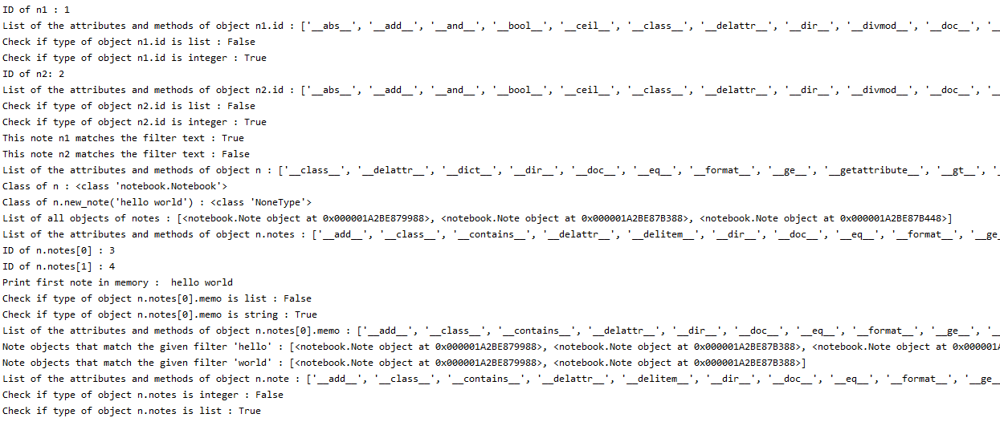

# notebook

### Description
Module notebook.py is an example of object oriented programming in Python.
It creates a notebook were we can add notes a menu were we can edit it in different ways.
Module notebook_test.py includes all tests to check if main modules work is correct, also it shows th work of functions isinstance and dir and examples to explain consepts of object, class attributes, class methods, self, method __init__, method __str__.

### Requirements
You need to import datatime and sys libraries

### Example of modules work

### Author
Anna Pashuk
